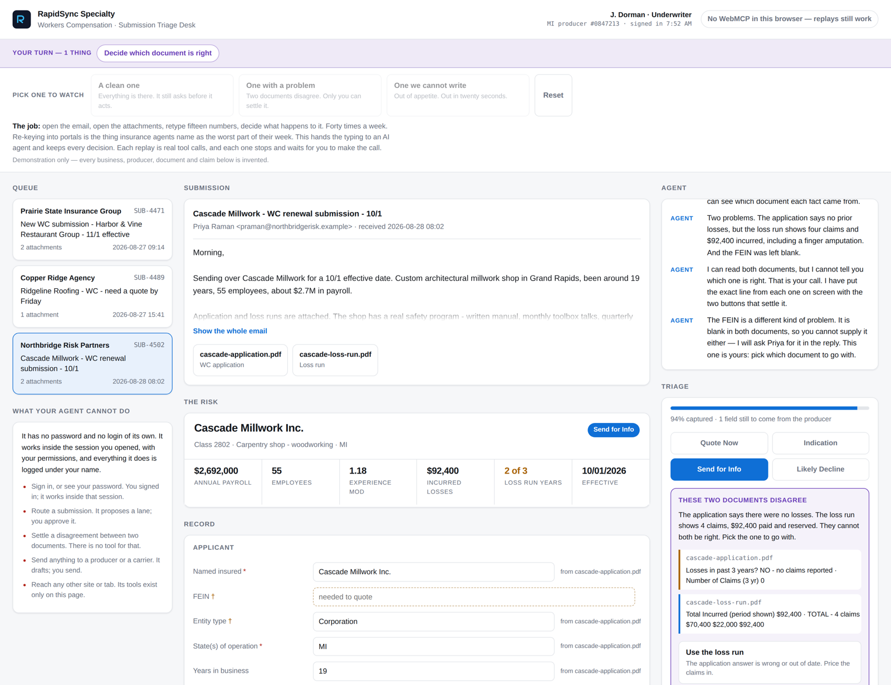

# Submission Triage Desk

**A workers' compensation submission desk that hands the browser agent real tools — and stops to ask a human when it hits something only a person can settle.**

Built by [RapidSync Specialty](https://rapidsyncspecialty.com) for the OpenAI WebMCP Challenge, 2026.

> Everything in the demo is invented. No real business, producer, document, or claim is represented.



---

## The problem

A wholesale insurance broker's submission desk receives an email from a retail agent: a few paragraphs of context, a workers' comp application PDF, and if you're lucky, a loss run. Someone has to read all of it, pull about fifteen facts out of it, check those facts against the carrier's appetite, notice when two documents disagree, and decide what happens to the file — quote it now, give a ballpark indication, go back to the producer for more, or decline it.

That job is a bad fit for full automation, because the expensive mistakes are the judgment calls. It's also a bad fit for a person doing all of it by hand, because most of the work is transcription.

## The credential problem, which is the real argument

Every existing way to automate this job needs somebody's password.

The tools sold into this market today — Appulate, Submission Bridge, Skyvern — bridge data *into carrier portals* by driving a browser, and to do that they need stored carrier credentials or a service account. That is a security problem, an E&O problem, and a licensing problem all at once: a system acting on a licensed producer's authority, holding their credentials, with no clean answer to who is responsible for what it submits.

**WebMCP removes the credential entirely.** The human signs in themselves. The agent has no password, no login, and no session of its own — it calls tools inside the session a licensed person already opened, with that person's permissions, and every action lands in the audit log under their name. There is nothing to store, nothing to rotate, and nothing to steal.

The page states this plainly, on screen, in a panel headed **What your agent cannot do**: sign in or see your password, route a submission, settle a disagreement between two documents, send anything to a producer or a carrier, or reach any other site or tab. Those aren't policies we promise. Five of them are enforced by there being no tool to do it.

That matters beyond security. No US regulator has yet answered whether an AI agency needs appointment, who the responsible licensed producer is, or who earns the commission — and Texas now requires a licensed human to review before a consequential action reaches a consumer or carrier. A design where the agent proposes and a named, licensed human decides is currently the only shape that is clearly compliant.

## Why this needs WebMCP, not a chatbot

An agent can already read an email. It can't do the other four things this desk does:

1. **Open the attachments.** The PDFs live on this page. The agent can't reach them. The page parses them and hands the text over through a tool.
2. **Know the house rules.** Prohibited class codes, the experience-mod ceiling, the incurred-loss threshold, what "complete enough to quote" means — those are RapidSync's rules, they live in this page's code, and they are deterministic. The agent gathers facts; the rules decide what the facts mean.
3. **Show its work on the screen the underwriter is already looking at.** Every value the agent writes appears in the record, labeled with where it came from. The underwriter can correct any of it by typing over it, mid-task, without going back to the chat.
4. **Hand the decision back.** Routing is the call this desk exists to make. The agent proposes and explains. A person clicks.

Take the tools away and none of that works. That's the test we built against.

## What people and agents can do together here that was hard before

The interesting moment is the contradiction.

The Cascade Millwork application says, in a checkbox, *no losses in the past three years*. The attached loss run from the prior carrier shows four claims and $92,400 incurred, including a finger amputation. Both documents are in the submission. Neither one is obviously wrong — applications get filled out by office managers, and loss runs get pulled at different valuation dates.

An agent working alone picks one and moves on, and it will sometimes pick wrong. A person working alone has to read both documents to notice at all.

Working together: the agent reads both documents, and credits each fact to the document it came from. The page's rules see the mismatch and stop. Then the page does the thing a chat window cannot — it puts **the actual line from each document** on screen, side by side:

> `cascade-application.pdf` — *Losses in past 3 years? NO - no claims reported*
> `cascade-loss-run.pdf` — *Total Incurred (period shown) $92,400 · TOTAL - 4 claims*

and two buttons: **Use the loss run** or **Use the application**, each saying what picking it means. One click settles it, and both answers stay on the file so the disagreement never disappears quietly. The file moves from *Send for Info* to *Indication*, for a reason both parties can see. If quoting the lines isn't enough, "check both documents side by side" opens the full extracted text of each.

**WebMCP has no built-in way for a tool to ask the user something.** There is no elicitation API in the spec; `requestUserInteraction()` is discussed in the working group but not specified, and Chrome's own docs describe it as if it exists. So a tool cannot hold a conversation — it can only change the page and return words to the agent. Both of those are used here: `ask_underwriter` highlights the field, writes the ask and the reason directly beside that field, names the job in a sticky bar that follows you down the page, **and** hands the agent the sentence to say. The answer comes back either by typing in the page or by telling the agent, and the agent picks it up on its next `check_submission`.

Every required field carries its own reason in `assets/state.js`, so the page can explain itself even when the agent supplies nothing. The FEIN's, for example: *carriers bind and file the policy on the FEIN, and it is how the experience mod is verified with the rating bureau.*

---

## How WebMCP is implemented

The whole agent-facing surface is one file: [`assets/webmcp.js`](assets/webmcp.js). Eight tools, registered on the top-level document.

| Tool | Read-only | What it does |
|---|:--:|---|
| `list_inbox` | ✓ | Lists the submissions waiting in the queue. |
| `open_submission` | | Opens one into the workspace, returns the email body and the attachment list. |
| `read_attachment` | ✓ | **The page parses a PDF and returns its text.** The agent can't do this alone. |
| `update_submission` | | Writes extracted values onto the record, optionally credited to the document they came from. They appear on screen immediately. |
| `check_submission` | ✓ | Runs the underwriting rules. Returns what's missing, what contradicts, what's out of appetite, and the current lane. |
| `ask_underwriter` | ✓ | Raises a field to the human: highlights it, explains why it matters, hands the agent the words to say. Changes no data. |
| `propose_routing` | | Puts a lane and its reasoning on screen. **Routes nothing.** A person clicks. |
| `draft_reply` | | Writes the email back to the producer naming what is still needed. **Sends nothing.** A person reads it, edits it, sends it. |

Every tool is a thin wrapper over a function the underwriter's own buttons call ([`assets/ui.js`](assets/ui.js)). There is no separate agent code path, so the tools cannot drift away from the interface.

### Choices worth pointing at

- **Nothing consequential runs on its own.** `propose_routing` was the obvious place to let an agent finish the job. It doesn't. Routing a submission decides whether a business gets a quote, and that stays with the underwriter.
- **`untrustedContentHint: true` on all three content tools.** The email and the attachments are written by people outside the company. `open_submission` also says so in its own output, in words, before the body.
- **Errors are returned, not thrown.** A bad submission id comes back as *"No submission with id X. Call list_inbox for the valid ids."* A model can recover from that. A rejected promise gives it nothing.
- **The UI updates before the tool returns.** Agents read the screen to decide what's next; returning early makes them act on stale state.
- **Unknown fields are reported back**, with the valid names, rather than silently dropped.
- **Settling a contradiction is not exposed as a tool.** The agent can see that one is open and that a person settled it, but there is no `resolve_conflict` for it to call. That is deliberate.
- **The input schema names every field explicitly** with a one-line hint each, so the model isn't guessing key names — and it asks for nothing about a person. Every field is a business underwriting fact taken from a document.
- **Tool budgets respected**: names ≤ 30 characters, descriptions ≤ 500, parameter descriptions ≤ 150, outputs ≤ 1,500. Enforced by the test suite.
- **PDF.js is vendored, not loaded from a CDN**, and it loads lazily — a slow or blocked third party can't stop the tools from registering.

### The rules

Deterministic, in [`assets/state.js`](assets/state.js), and shown on screen so the underwriter can see what fired:

- **Likely Decline** — the governing class code is on the prohibited list, the experience mod is above 1.35, or incurred losses are above $150,000.
- **Send for Info** — two documents contradict each other, or something required to quote is missing.
- **Indication** — complete and in appetite, but the loss runs cover fewer than three years, so a ballpark is all that's honest.
- **Quote Now** — clean.

Appetite is checked first, on purpose. You don't spend an hour gathering data on a risk you'll never write.

---

## Running it

Any static file server. Nothing to build, no backend, no keys.

```bash
npx serve .
# or: python3 -m http.server 8000
```

Then open it in **ChatGPT's built-in browser** (desktop app, GPT-5.6 Sol or Terra, with *Settings → Browser → Permissions → Enable site tools* on), or in **Chrome 149+** with `chrome://flags/#enable-webmcp-testing` enabled.

Say to your agent: **"Work the Cascade Millwork submission."**

### Tests

```bash
npm install     # playwright
npm test
```

`test/e2e.mjs` stubs `document.modelContext`, drives all seven tools the way an agent would, and walks the full scenario end to end — including the handoff to the human and back. It also asserts every tool stays inside the character budgets. 59 checks.

`test/shot.mjs` writes screenshots of the desk mid-scenario in both light and dark.

`test/preview.mjs` drives the hosted preview end to end — presses play, checks the contradiction is
shown with its receipts, settles it, and confirms it resumes to a routing proposal and a drafted reply. 54 checks.

### The hosted preview

`build_preview.py` assembles `preview/triage-desk-preview.html`: the same code as the deployed app
in a single file, with a scripted agent so the desk can be watched without an agent attached. It
calls the same registered tools in the same order, and it stops and waits for a person at exactly
the point the real one does. PDF.js is left out of that build; `read_attachment` returns the text
PDF.js produced at build time, captured by `test/dump-text.mjs`, so tool output is identical.

---

## The demo

Three submissions in the queue, each landing in a different lane:

Each of the three is playable in the hosted preview, and each ends in a different lane with a
different work product.

| Submission | What happens | It ends with |
|---|---|---|
| **Harbor & Vine Restaurant Group** | Clean and complete. Three years of loss runs, mod 0.92, in appetite. Nothing to argue about — and it still stops for your approval. → **Quote Now** | A reply saying terms are coming and nothing is needed from the producer. |
| **Ridgeline Roofing** | The producer pushes hard for a Friday turnaround and vouches for the mod. The agent reads the application anyway: governing class 5551 is prohibited, so the deadline changes nothing. No loss runs were attached and it does not chase them — there is no point gathering data on a risk you will never write. → **Likely Decline** in about twenty seconds. | A real decline letter, sent the same day so the producer can still place it. |
| **Cascade Millwork** | The application and the loss run disagree, and the FEIN is missing. → **Send for Info**, until a person settles it — then **Indication**, because the loss runs only cover two years. | An indication, plus a numbered list of exactly what is needed to turn it into a quote. |

The replays have no Continue button. They wait on the actual action — the FEIN typed in, the
contradiction settled, the routing approved — and resume the moment you do it. Stall and the agent
tells you what it is still waiting on.

---

## Layout

```
index.html            the desk
assets/webmcp.js      every tool the agent can call — start here
assets/state.js       the record, the queue, and the underwriting rules
assets/ui.js          rendering, and the functions both the buttons and the tools call
assets/vendor/        PDF.js (Apache-2.0), vendored
docs/                 the synthetic application and loss run PDFs
test/                 end-to-end scenario, budget checks, screenshots
build_docs.py         regenerates the demo PDFs
build_preview.py      assembles the single-file hosted preview
preview/              the assembled preview
```

## License

MIT. See [LICENSE](LICENSE).

PDF.js is Apache-2.0; see `assets/vendor/pdfjs-LICENSE.txt`.
